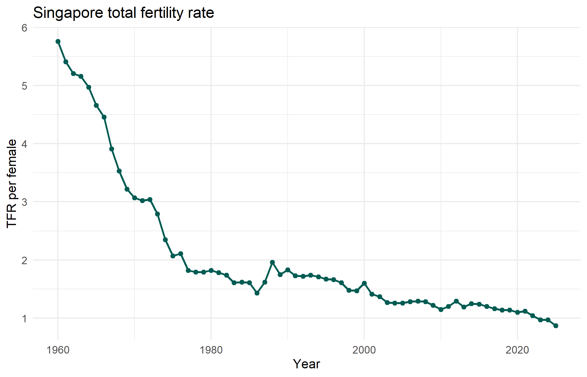
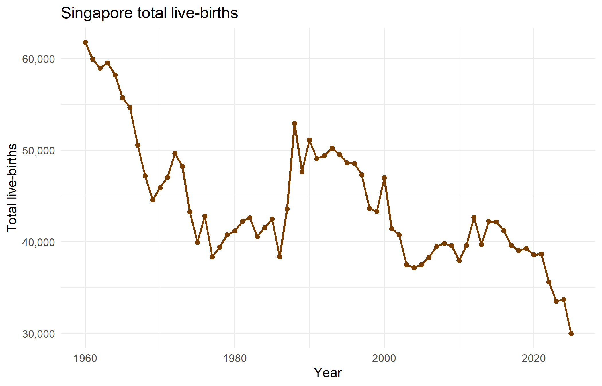
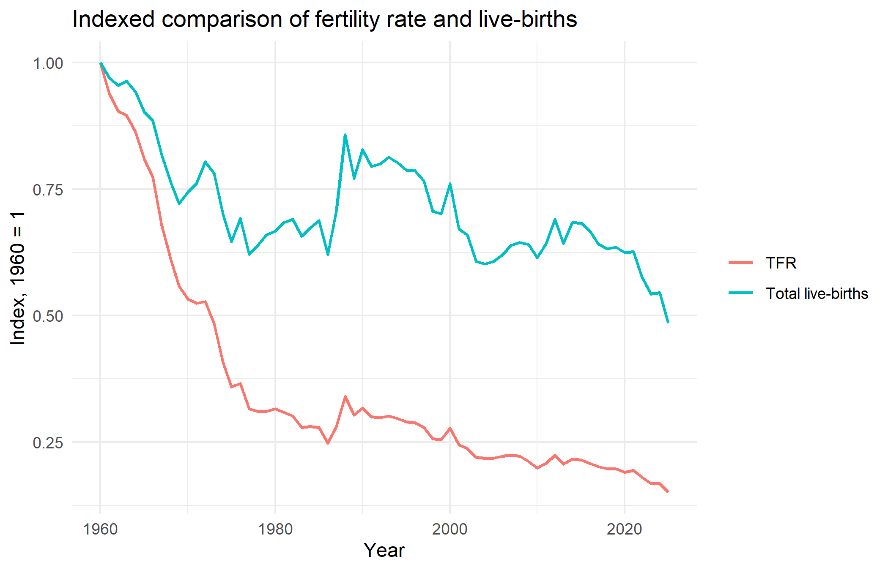
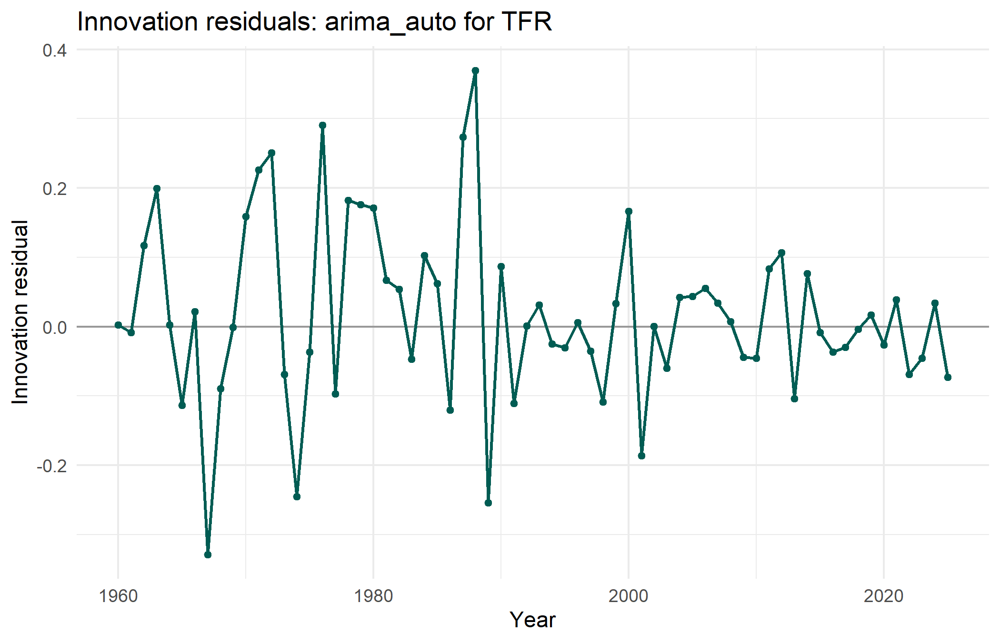
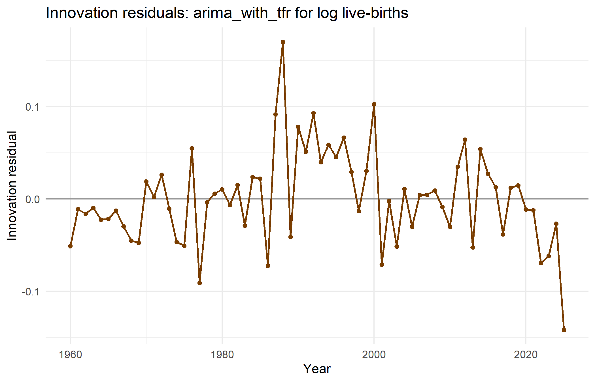
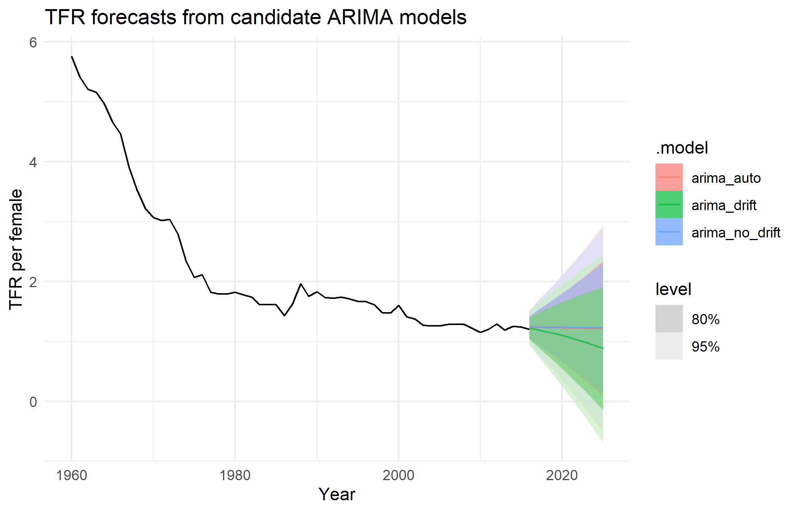
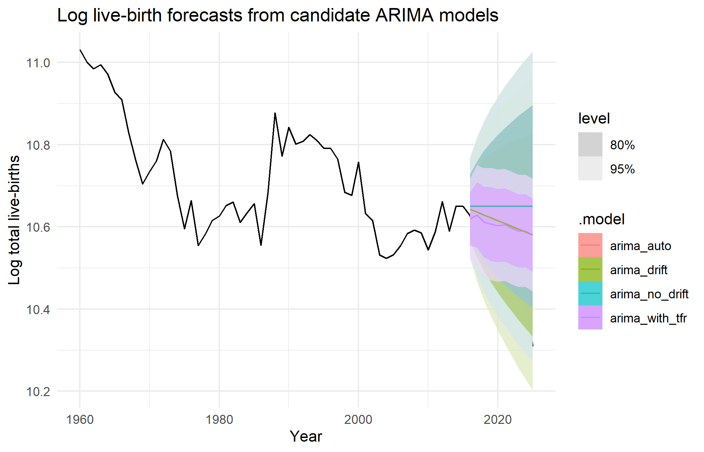

```{r}
if (basename(getwd()) == "report") {
  setwd("..")
}
source("R/00_setup.R")
source("R/01_data_import.R")
```

# Research Question

Singapore has experienced a long decline in fertility, but the total number of births is not determined by fertility rates alone. It is also affected by cohort size, migration, marriage timing, and broader demographic structure. This report asks:

> How have Singapore's total fertility rate and total live-births evolved over time, and how well can short-horizon time series models forecast these demographic indicators?

The question has both an inferential and a forecasting component. The inferential component is to describe the persistence, trend and possible structural change in fertility and births. The forecasting component is to compare simple time series models for short-horizon prediction.

# Data

The data come from the official data.gov.sg dataset `Births And Fertility Rates, Annual`, published through SingStat. The reproducible workflow downloads the dataset through the data.gov.sg API and extracts two annual series:

- `tfr`: total fertility rate (TFR), interpreted as births per woman under current age-specific fertility rates.
- `total_live_births`: total annual live-births.

The processed data cover 1960 to 2025. In this period TFR fell from 5.76 in 1960 to 0.87 in 2025. Total live-births fell from 61,775 in 1960 to 30,004 in 2025, although the path is less monotone than the fertility rate series. Total live-births are modelled on the log scale to make changes closer to proportional changes.

# Exploratory Analysis

```{r}
source("R/02_eda.R")
```





The TFR series shows a strong downward trend. The largest decline occurs early in the sample, followed by a lower and flatter period after the late 1970s. There are temporary rebounds, including a visible increase around the late 1980s, but these do not reverse the long-run decline.

The total live-births series also declines over the full sample, but it fluctuates more than TFR. This is expected because live-births depend not only on fertility rates but also on the number of women at child-bearing ages and other demographic conditions. The indexed comparison shows that TFR fell much more sharply than total births over the long sample.



The ACF plots for the raw series show strong persistence, which is consistent with non-stationarity. KPSS tests support this reading: the KPSS p-values are 0.01 for both raw TFR and log total live-births. First differencing resolves the stationarity issue for log total live-births in this workflow, with KPSS p-value 0.10. First-differenced TFR still has KPSS p-value 0.01, which suggests that the fertility series may contain persistent structural change rather than only a simple stochastic trend.

# Methods

Annual data have no within-year seasonality, so the main candidate models are non-seasonal ARIMA models. For a series \(y_t\), an ARIMA model can be written as

\[
\phi(B)(1-B)^d y_t = c + \theta(B) z_t,
\]

where \(B\) is the backshift operator, \(d\) is the differencing order and \(z_t\) is white noise. Candidate models were fitted using the `ARIMA()` function from `fable`, and compared using AICc, residual diagnostics and a ten-year holdout forecast evaluation.

For TFR, the candidate set includes automatic ARIMA selection, an ARIMA model with drift, and an ARIMA model without drift. For total live-births, the response is \(\log(\text{births})\). The candidate set includes automatic ARIMA models and a model with TFR as an explanatory variable:

\[
\log(Births_t) = \beta_0 + \beta_1 TFR_t + n_t,
\]

where \(n_t\) follows an ARIMA error process. This model is useful because it directly tests whether TFR helps explain annual live-birth levels, while still allowing serially correlated model errors.

For the live-birth model, the holdout evaluation is a conditional forecast exercise because the forecast step supplies the observed TFR values in the test period. This is useful for measuring whether TFR contains explanatory information for live-births, but a real future forecast would need either a separate forecast of TFR or explicit TFR scenarios.

# Results

```{r}
source("R/03_models.R")
```

For TFR, the AICc-best model is the automatically selected ARIMA model, with AICc -75.73. The ARIMA model with drift has AICc -74.14, so it is worse by AICc but not by a large margin. Its Ljung-Box p-value is 0.382, which does not indicate strong residual autocorrelation at lag 10.

For log total live-births, the model using TFR as an explanatory variable has the best AICc by a clear margin: -192.53 compared with approximately -180.41 for the next best candidates. The estimated TFR coefficient is positive at 0.116, with a very small p-value, indicating that higher fertility rates are associated with higher log live-birth levels in this model.

However, the residual diagnostic result for the TFR-explanatory model is not perfect. Its Ljung-Box p-value is 0.0185, suggesting remaining serial dependence in the residuals. This means the model is useful, but not a complete final explanation of the birth series. This point is important for the discussion and motivates further model refinement in the appendix.





# Forecasting Evaluation

```{r}
source("R/04_forecast_evaluation.R")
```

The most recent ten years were held out for forecast evaluation. This gives a more direct check of short-horizon predictive performance than AICc alone.

For TFR, the holdout results differ from the AICc ranking. The ARIMA model with drift has the lowest test RMSE, 0.0281, compared with 0.178 for the automatic ARIMA model and 0.186 for the no-drift model. This is a substantial difference. For a forecasting objective, the drift model is therefore the current preferred TFR model, even though the automatic ARIMA model is slightly better by AICc on the full sample.

For log total live-births, the model with TFR as an explanatory variable has the best holdout RMSE, 0.123. The drift model is close at 0.126, while the automatic and no-drift models are worse at 0.167. This agrees with the AICc comparison and supports using TFR as a predictor for the live-birth model, while still noting the residual autocorrelation issue.

This comparison should be interpreted carefully. The birth model with TFR is evaluated using known holdout TFR values, so its accuracy is conditional on that regressor being available. The result therefore supports TFR as an informative demographic predictor, but it does not by itself prove that future live-births can be forecast with the same accuracy unless future TFR is also forecast or assumed through scenarios.





# Discussion

The analysis shows that both TFR and total live-births have persistent long-run decline, but their dynamics are not identical. TFR is smoother and more directly downward, while live-births contain additional demographic variation. This supports modelling them separately rather than treating births as a simple rescaling of fertility.

The most important modelling lesson is that model selection depends on the goal. AICc and holdout accuracy do not select the same TFR model. For explaining the in-sample stochastic structure, the automatic ARIMA model is competitive. For short-horizon forecasting over the recent holdout period, the drift model is much better. For live-births, adding TFR improves both AICc and holdout RMSE, but residual autocorrelation remains, so the model should be interpreted as a useful candidate rather than a fully adequate final model.

The main limitation is that the current models are univariate or use only TFR as one explanatory variable. The TFR coefficient should not be read as a causal estimate because the model omits population composition, migration, marriage rates, policy changes and other demographic drivers. A richer demographic forecast could include age-specific fertility rates, female population by age group, marriage rates, policy indicators, and structural break terms. These additions would be especially relevant because the TFR stationarity diagnostics suggest persistent structural change.

# References

- Singapore Department of Statistics. `Births And Fertility Rates, Annual`, accessed through data.gov.sg.
- Hyndman, R. J., and Athanasopoulos, G. (2021). *Forecasting: Principles and Practice*, 3rd edition.
- O'Hara-Wild, M., Hyndman, R., and Wang, E. (2024). `fable`: Forecasting Models for Tidy Time Series.
