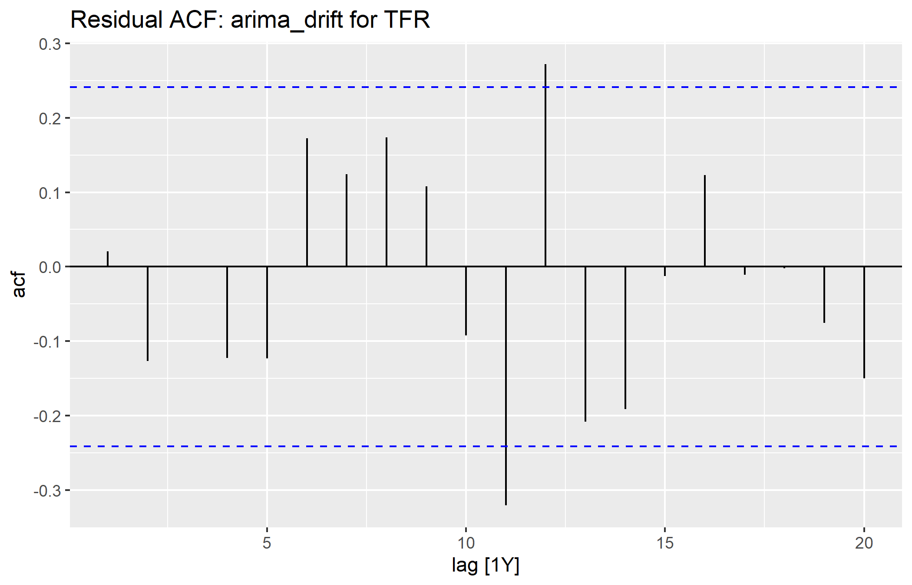
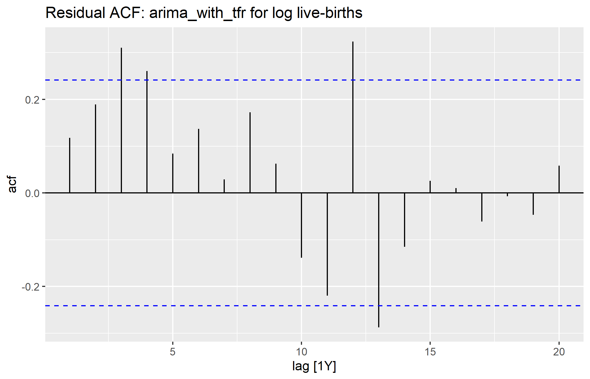

```{r}
if (basename(getwd()) == "report") {
  setwd("..")
}
source("R/00_setup.R")
source("R/01_data_import.R")
```

# Data Processing Details

The raw data are downloaded from the data.gov.sg API in `R/01_data_import.R`. The source table stores each data series as a row and each year as a column. The workflow:

1. trims whitespace in `DataSeries`;
2. keeps `Total Fertility Rate (TFR)` and `Total Live-Births`;
3. pivots the year columns into a long format;
4. converts year labels to integers and values to numeric;
5. pivots the two selected variables into a single annual table;
6. creates `log_total_live_births`, `tfr_difference`, and `log_births_difference`;
7. stores the cleaned data as a yearly `tsibble`.

The final processed table contains 66 annual observations from 1960 to 2025.

```{r}
head(fertility_births)
tail(fertility_births)
```

# Stationarity Diagnostics

KPSS tests were used as a formal diagnostic because the raw plots and ACFs suggest persistent trend. The null hypothesis of the KPSS test is stationarity. Small p-values therefore indicate evidence against stationarity.

```{r}
stationarity_diagnostics <- readr::read_csv(
  "data/processed/stationarity_diagnostics.csv",
  show_col_types = FALSE
)
stationarity_diagnostics
```

The raw TFR and raw log live-births series have KPSS p-values of 0.01, which is consistent with non-stationarity. Differenced log live-births has p-value 0.10, which is more consistent with stationarity. Differenced TFR still has p-value 0.01, suggesting stronger persistence or structural change.

# Candidate Model Summaries

```{r}
source("R/03_models.R")
tfr_model_summary
birth_model_summary
```

The TFR candidate models are close by AICc. The automatic ARIMA model has the lowest AICc, while the drift and no-drift alternatives are within a small range. This means the TFR model choice should not rely on AICc alone.

The live-birth candidate models show a clearer AICc preference. The model with TFR as an explanatory regressor has the lowest AICc by a large margin.

# Parameter Estimates

```{r}
tfr_model_coefficients <- readr::read_csv(
  "data/processed/models/tfr_model_coefficients.csv",
  show_col_types = FALSE
)
birth_model_coefficients <- readr::read_csv(
  "data/processed/models/birth_model_coefficients.csv",
  show_col_types = FALSE
)

tfr_model_coefficients
birth_model_coefficients
```

For the forecast-focused TFR drift model, the AR coefficient is close to one and the MA coefficient is negative. The estimated drift constant is small and not statistically significant at conventional levels. This is one reason the model should be interpreted cautiously even though it performs well in the holdout exercise.

For the live-birth model with TFR as an explanatory variable, the estimated TFR coefficient is 0.116 on the log-birth scale. Holding the ARIMA error structure fixed, higher TFR is associated with higher live-birth levels.

# Residual Checks

```{r}
tfr_residual_tests <- readr::read_csv(
  "data/processed/models/tfr_residual_ljung_box.csv",
  show_col_types = FALSE
)
birth_residual_tests <- readr::read_csv(
  "data/processed/models/birth_residual_ljung_box.csv",
  show_col_types = FALSE
)

tfr_residual_tests
birth_residual_tests
```

The TFR candidates have Ljung-Box p-values above 0.25 at lag 10, so the current residual tests do not provide strong evidence of remaining autocorrelation.

The live-birth model with TFR as an explanatory variable has a Ljung-Box p-value of 0.0185. This indicates that its residuals are not fully white noise. It remains the best candidate by AICc and holdout RMSE among the models currently implemented, but additional model development is warranted.





# Forecast Evaluation

The forecast evaluation uses the most recent ten years as a holdout sample. This provides an out-of-sample check that is separate from in-sample likelihood-based model comparison.

```{r}
source("R/04_forecast_evaluation.R")
tfr_accuracy
birth_accuracy
```

For TFR, the drift model is clearly best by RMSE. This is why it is used as the forecast-focused TFR model in the main report. For log live-births, the TFR explanatory model is best by RMSE, although the residual diagnostics indicate that it should be refined further.

# Models Not Selected

The following models remain useful but are not the current preferred forecast models:

- TFR automatic ARIMA: best by AICc, but much worse on the ten-year holdout sample.
- TFR no-drift ARIMA: similar residual behaviour to the drift model, but weaker holdout performance.
- Log live-birth automatic ARIMA: simple benchmark, but worse AICc and holdout RMSE than the model with TFR.
- Log live-birth drift and no-drift ARIMA models: useful baselines, but they do not use fertility information directly.

The next modelling step should consider structural breaks or additional regressors, especially for the live-birth model where residual autocorrelation remains.
